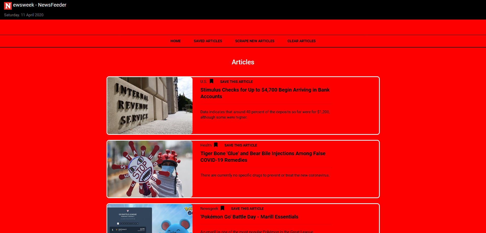
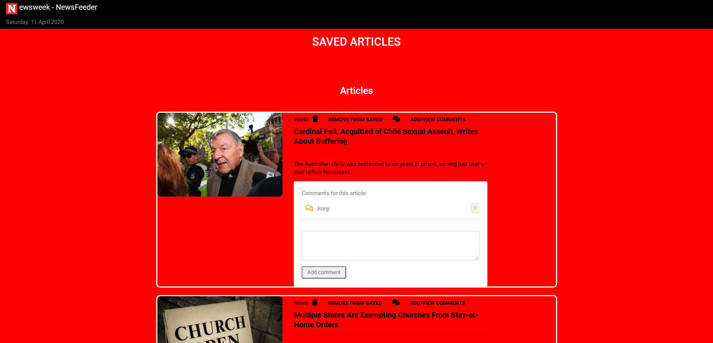
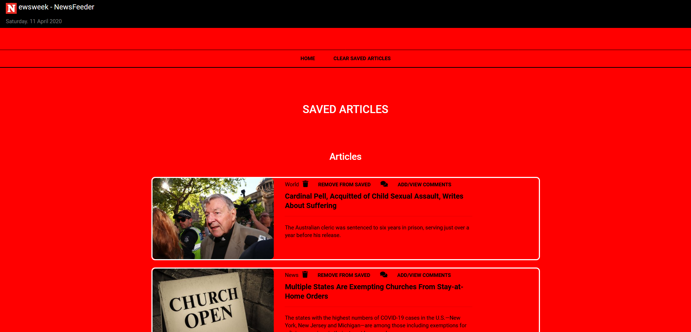
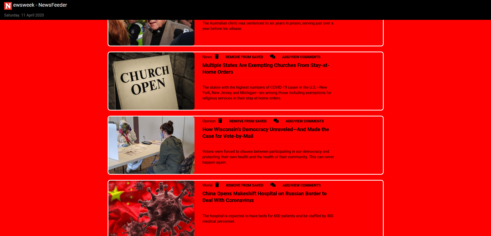

# Newsfeeder - Newsweek Scraper

## Purpose:

Using Cheerio create an application to scrape a news source. Display the articles and allow the user to add/view comments.
Description

## How it works:

Newsfeeder scrapes https://www.newsweek.com/. The scraped articles will be displayed in article sections. The user can save selected articles by clicking on the "Save This Article" link. In the 'Saved Articles' page, the user can then view the the saved articles.

On the Saved Articles page:

The user can view the comments associated with each article by clicking on the "Add/View Comments' link. Any comments associated with the article will be displayed in a modal. The user may delete or add a new comment.

The user can remove a saved article by clicking on the "Remove from Saved" link. Removing an article will simply remove the saved article from the "Saved Articles" page.

Link to app deployed on Heroku: [Newsfeeder](https://aqueous-falls-51327.herokuapp.com/)

## Tools

NPM Libraries

    express
    body-parser
    mongoose
    express-handlebars
    cheerio
    axios

Frameworks

    Bootstrap
    

